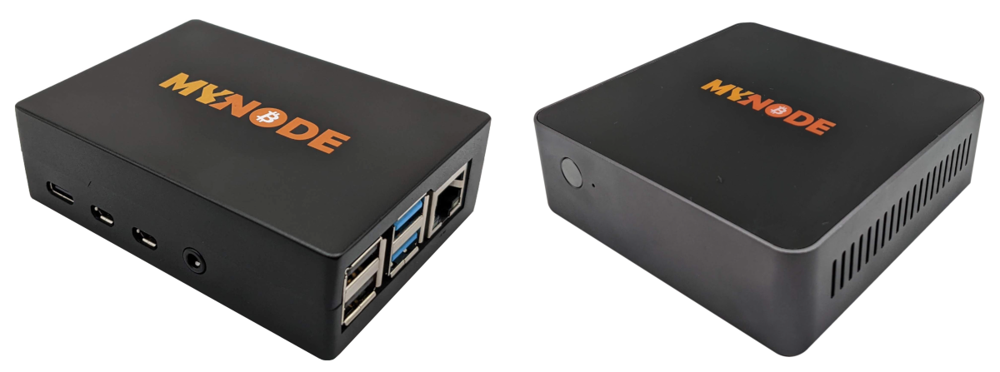
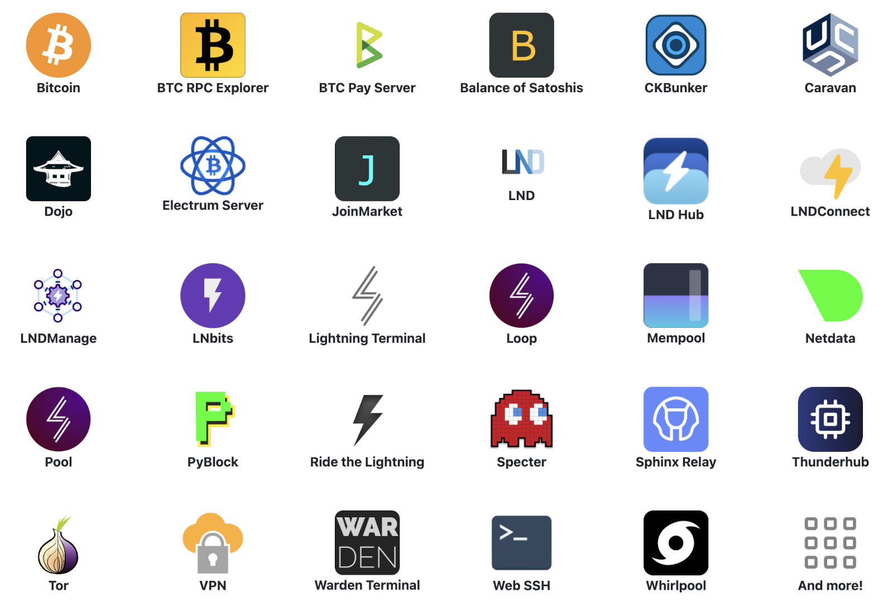
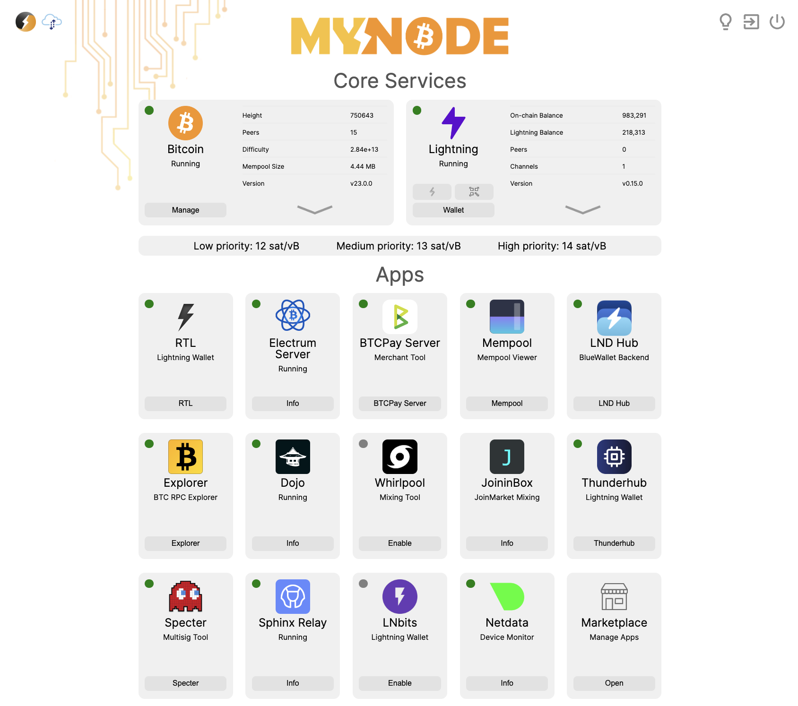
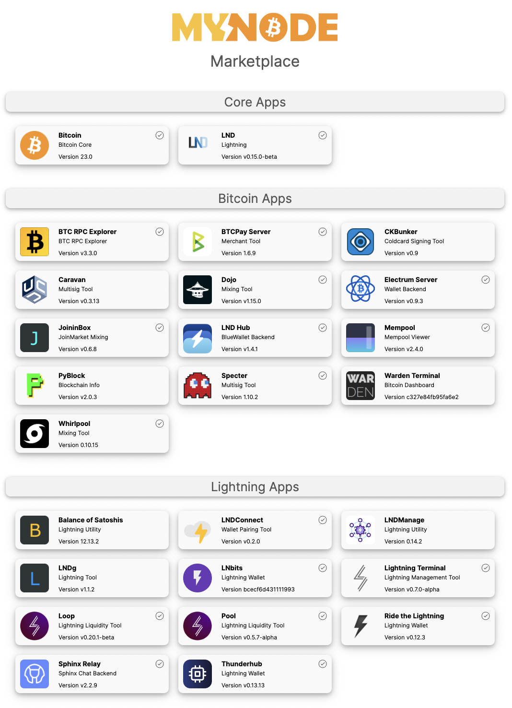

[](https://github.com/mynodebtc/mynode)

[](https://github.com/mynodebtc/mynode/tag)
[](https://t.me/mynode_btc)

[](https://twitter.com/mynodebtc)


# Bitcoin, Lightning, and more!
MyNode aims to be the easiest way to run a dedicated, easy to use, Bitcoin Node and Lightning Wallet!
                            
We combine the best open source software with our interface, management, and support so you can easily, privately, and securely use Bitcoin and Lightning.

Website: https://mynodebtc.com


## User Interface


## Overview
MyNode is a platform that provides uptime, reliability, ease-of-use and a huge variety of applications! By integrating a number of Bitcoin-related open source projects, it provides access to Bitcoin and Lightning along with a number of other features.

By running Bitcoin and Lightning on your MyNode device, you maintain all the security and privacy originally intended in the Bitcoin protocol. Your transactions are verified by your local node, removing the need to trust online 3rd parties for spending or verifying funds.

## MyNode Premium
MyNode offers premium support, simplified upgrades and more! If you are running MyNode Community Edition and want one-click upgrades or you want to purchase a supported, high quality device, please visit mynodebtc.com.

Upgrade now or purchase a device at:<br/>
https://mynodebtc.com/order_now

<b>Devices - Model One and Model Two</b>
<br/>


## Features
Each MyNode device comes with a number of wonderful features.


<!--
- Bitcoin Node
- Lightning Node
- Electrum Server
- BTCPay Server
- RTL (Ride the Lightning) - Lightning Wallet
- Specter Desktop
- Thunderhub
- BTC RPC Explorer
- Mempool - Mempool local visualizer for the Bitcoin blockchain
- LND Hub - Lightning Wallet Server
- Lndmanage
- Lightning Loop - A Non-Custodial Off/On Chain Bridge
- Lightning Pool - A Non-Custodial auction for liquidity where bids are kept private and trades clear periodically
- Lightning Terminal
- LNBits
- Caravan
- Warden Terminal
- PyBlock
- Lndmanage
- Tor
- JoininBox / JoinMarket
- LND Connect - Generate QR Codes for connecting wallets
- Virtual Machine support (OVA file: VirtualBox, VMWare)
- VPN for Remote Access
- Bitcoin CLI
- QuickSync - Quickly sync Bitcoin blockchain
- LN Channel Backup
- Docker support (containers inside: Netdata Monitor, Glances, WebSSH2 (Linux Terminal), BTCPay Server)
- Simple UI / Web Interface
- Dark Mode interface
- Dedicated hardware keeps you constantly and securely connected!
-->

## Running MyNode
You can run MyNode on your own device in just a few easy steps!

1. Download an Image
    * [Downloads](https://mynodebtc.com/download)
2. Flash Image onto SD Card
    * Download [Etcher](https://www.balena.io/etcher/)
    * Flash Downloaded Image
3. Insert SD Card, connect ethernet cable to router, and Boot your Device
4. Attach External Drive to Device
    * 1TB+ Required
5. Visit http://mynode.local/ or http://ip_of_device/

## Supported Devices
We currently have images for the following devices available for download.
 - Raspberry Pi 4
 - RockPro64
 - Rock Pi 4
 - PCs and Servers
 - Virtual Machine Support (VirtualBox, VMWare)

## Upgrading your MyNode
Once you are running MyNode, you can easily [update the software](https://mynodebtc.github.io/device/upgrading-device.html) yourself!


## Developing for MyNode

### Developing the MyNode Platform
See the [development guide](https://github.com/mynodebtc/mynode/blob/master/doc/development.md).

### Adding new Applications to MyNode
To develop and add new applications to MyNode, check out the [Software Development Kit (SDK)](https://github.com/mynodebtc/mynode_sdk).


## Install on Existing System (beta)
To setup a new device on a supported platform that is already running Linux (Raspi4, RockPi 4, RockPro64, PC, ...), you can run two simple commands.

First, install Debian - last tested with the Debian 10.11 (Buster) images.

Second, login and run these two commands.

```
wget https://raw.githubusercontent.com/mynodebtc/mynode/latest_release/setup/setup_device.sh -O mynode_setup.sh
sudo bash ./mynode_setup.sh online
```

Once the script successfully completed, reboot and you will be running MyNode!

## Screenshots


--------------------


--------------------


--------------------



--------------------


## What is Bitcoin?
Bitcoin is a unique form of digital money that enables users to send money over the Internet securely without the need for banks or other 3rd parties. This enables anyone with Internet access the ability to participate in the global economy no matter where they live - anywhere from rural Africa to Venezuela to Antarctica to space!

Bitcoin is also unique in that it is deflationary and only has a finite amount of Bitcoin that will ever exist - 21 million. This is similar to land or other valuable natural resources that are limited in their supply. This limited supply is based on computer software algorithms built into the Bitcoin protocol. No person, company, or government can change that limit. This makes Bitcoin valuable to many people who want to save money.

The Lightning Network is another layer on top of Bitcoin, speeding up the rate at which Bitcoin can be sent. Bitcoin transactions are very secure, but can take time to fully confirm. The Lightning Network allows people to send Bitcoin back and forth without the need to wait for each transaction to be included in a Bitcoin block.

There is much more to Bitcoin and the Lighting Network than is mentioned here. For more information, start with these links.

<a href="https://www.upfolio.com/ultimate-bitcoin-guide">Ultimate Bitcoin Guide</a>

<a href="https://medium.freecodecamp.org/explain-bitcoin-like-im-five-73b4257ac833">Explain Bitcoin Like I’m Five</a>

<a href="https://www.lopp.net/bitcoin-information.html">Bitcoin Information</a>

## Security
There are many reasons to run a Bitcoin Node. It helps keep the Bitcoin network secure and reduces the trust you are giving others when using 3rd party Bitcoin Explorers or Bitcoin Light Wallet servers. They can track you or give you false information, reducing your security and privacy. A “full node”, like the Bitcoin node running on your MyNode device, personally validates all blocks in the Bitcoin blockchain making sure your Bitcoin transactions and Lightning network use is built on the strongest, most trusted foundation possible.

By using MyNode for your Lightning Wallet, Bitcoin Wallet, and Block Explorer, you no longer have to trust others to give you the correct information! This increases your security when protecting your valuable assets.

Please note, MyNode is not responsible for any lost funds while using your device. We have taken significant measures to protect your assets by securing MyNode, but lightning wallets are meant to be online and used for spending where risks are greater. Please do your own research into Bitcoin and the Lightning Network before investing in cryptocurrency.

For long term storage of cryptocurrency assets, please consider using a hardware wallet, like a Ledger or Trezor.

## Community
MyNode has a wonderful, helpful community that assists with development and support. It would be impossible to run this project without their involvement and support! The effort they put in to make this, and all Bitcoin projects, a success is truly appreciated.

## Bounties
It takes a lot of work to add new features and maintain MyNode. In order to provide desired features, improve documentation, and help provide the best product possible, some new features and improvements have bounties associsated with them. If anyone in the community would like to implement improvements, they can claim the bounty.

[Bounty List](https://github.com/mynodebtc/mynode/blob/master/doc/bounties.md)

## License
The primary MyNode License is a variation of CC BY-NC-ND 4.0 with some modifications in Section 9.

This license applies to the MyNode platform, but each application likely has its own license and code to integrate each application to MyNode uses the LGPL v3.0. Code to add applications can be stored under `./rootfs/standard/usr/share/mynode_apps/` and uses the License file at `./rootfs/standard/usr/share/mynode_apps/LICENSE.md`.

## Responsible Disclosure
Found any critical bugs or vulnerabilities? Please send us an email at admin@mynodebtc.com. Thanks!
